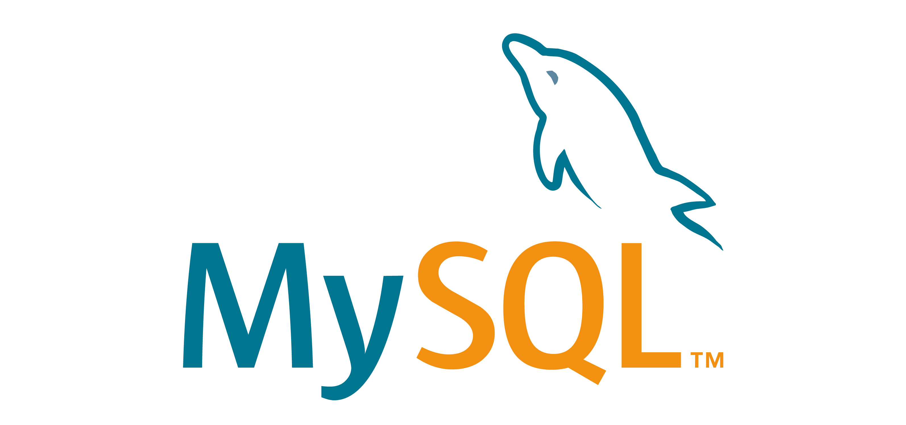

## Hi there 👋    

- 🔭 I’m currently working on creating a well curated portfolio of my projects
- 🌱 I’m currently learning PowerShell, Bash, Python
- 👯 I’m looking to collaborate on Database Management Projects, Data Analysis Projects
- 💬 Ask me about data cleaning techniques and database management
- 📫 Reach me at [Email](gmail:kibetsang001@gmail.com)

## 🌍 Connect with Me:

- The tools I most commonly use are;

  
  
  
  
<<<<<<< HEAD
  
=======
  
>>>>>>> 13eddb01df73f1c277cbc06afdfa37eebb2ae22c
  
  

- Data Analyst📊📈
- Database Manager🗃🗄
